# Jarkom Modul1 Lapres T12
## Soal
Terdapat tiga buah file *.pcapng yang mendukung soal-soal display filter, yaitu:
- File pertama untuk menjawab soal nomor 1-5 dan nomor 10.
- File kedua untuk menjawab soal nomor 6, 7, dan 9.
- File ketiga untuk menjawab soal nomor 8.
#### A. Display Filter
1. Sebutkan webserver yang digunakan pada "testing.mekanis.me"!
2. Simpan gambar "Tim_Kunjungan_Kerja_BAKN_DPR_RI_ke_Sukabumi141436.jpg"!
3. Cari username dan password ketika login di "ppid.dpr.go.id"!
4. Temukan paket dari web-web yang menggunakan basic authentication method!
5. Ikuti perintah di aku.pengen.pw! Username dan password bisa didapatkan dari file .pcapng!
6. Seseorang menyimpan file zip melalui FTP dengan nama "Answer.zip". Simpan dan Buka file "Open This.pdf" di Answer.zip. Untuk mendapatkan password zipnya, temukan dalam file zipkey.txt (passwordnya adalah isi dari file txt tersebut).
7. Ada 500 file zip yang disimpan ke FTP Server dengan nama 1.zip, 2.zip, ..., 500.zip. Salah satunya berisi pdf yang berisi puisi. Simpan dan Buka file pdf tersebut. Your Super Mega Ultra Rare Hint = nama pdf-nya "Yes.pdf"
8. Cari objek apa saja yang didownload (RETR) dari koneksi FTP dengan Microsoft FTP Service!
9. Cari username dan password ketika login FTP pada localhost!
10. Cari file .pdf di wireshark lalu download dan buka file tersebut! clue: "25 50 44 46"
#### B. Capture Filter
11. Filter sehingga wireshark hanya mengambil paket yang mengandung port 21!
12. Filter sehingga wireshark hanya mengambil paket yang berasal dari port 80!
13. Filter sehingga wireshark hanya menampilkan paket yang menuju port 443!
14. Filter sehingga wireshark hanya mengambil paket yang berasal dari ip kalian!
15. Filter sehingga wireshark hanya mengambil paket yang tujuannya ke monta.if.its.ac.id!
## Jawaban
#### A. Display Filter
##### 1. *Webserver: nginx/1.14.0 (Ubuntu)*
```sh
Display Filter: http.host == “testing.mekanis.me”
```
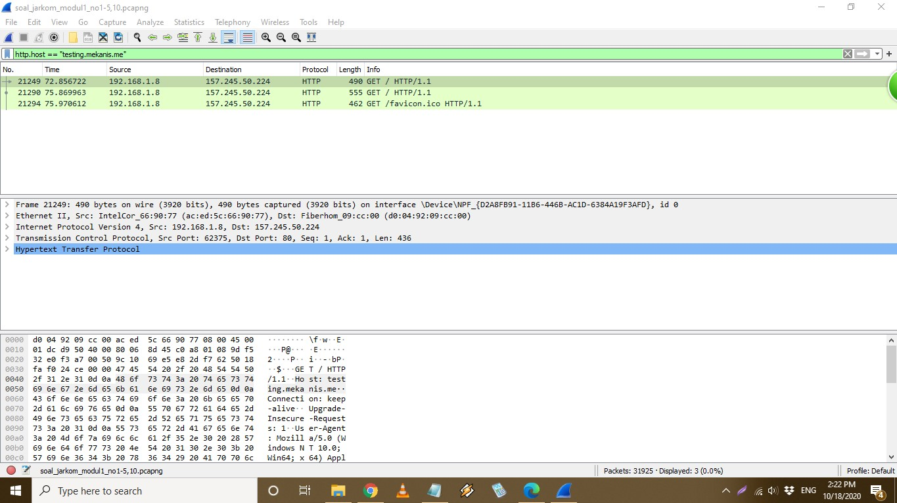
```sh
Follow TCP Stream
```
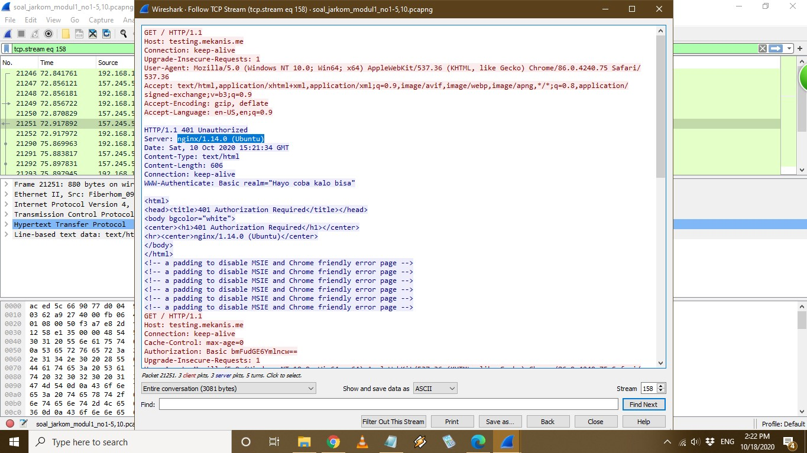
##### 2. *Hasil berupa gambar Tim_Kunjungan_Kerja_BAKN_DPR_RI_ke_Sukabumi141436.jpg*
```sh
File -> Export Objects -> HTTP
```
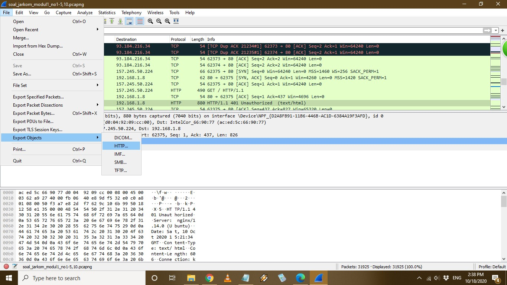
```sh
Text Filter: Tim_Kunjungan_Kerja_BAKN_DPR_RI_ke_Sukabumi141436.jpg
```
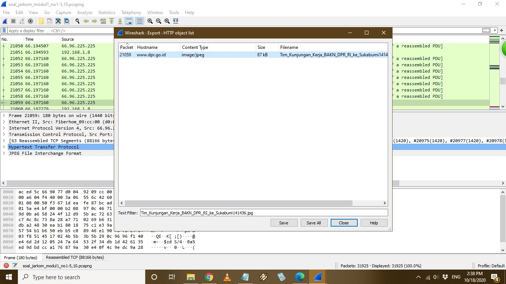
```sh
Save dengan format JPG
```

```sh
Buka Gambar
```
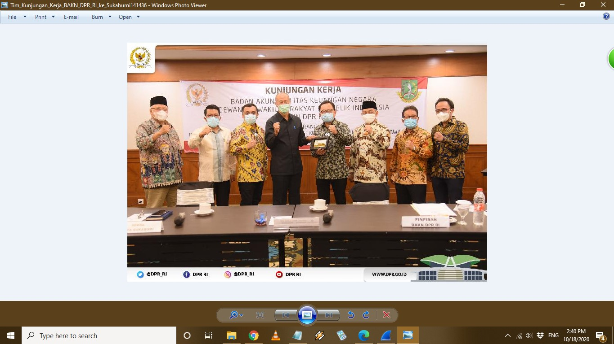
##### 3. *Username: 10pemuda , Password: guncangdunia*
```sh
Display Filter: http.host == "ppid.dpr.go.id"
```
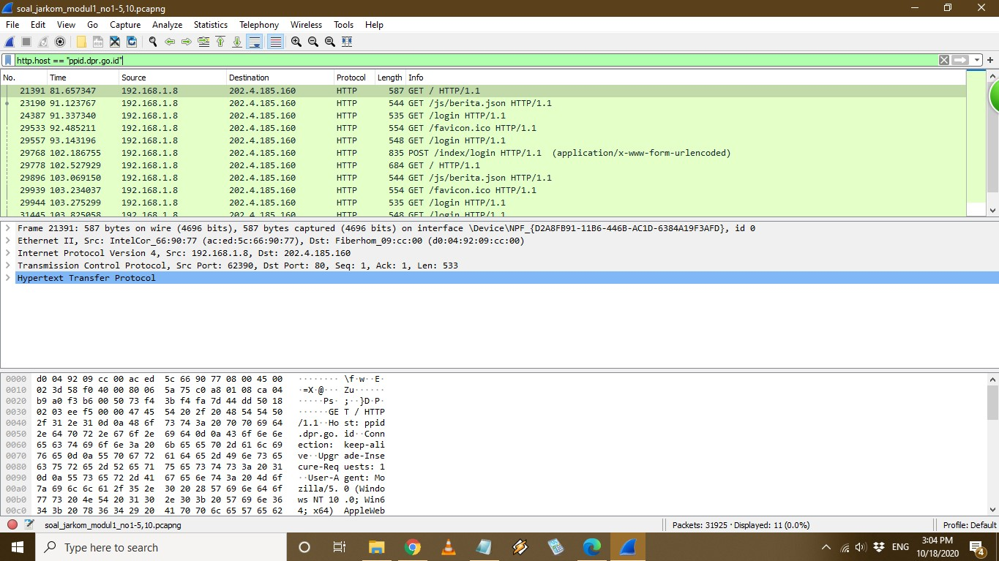
```sh
Lihat HTML Form URL Encoded pada Paket yang memiliki Method POST
```
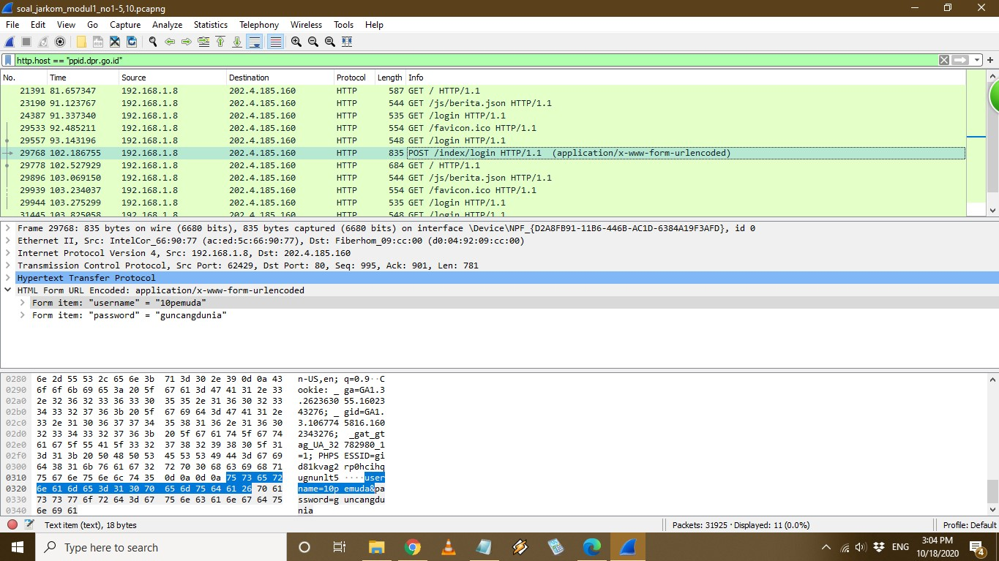
##### 4. *Tedapat 5 Paket yang basic authentication method*
```sh
Display Filter: http.authbasic
```
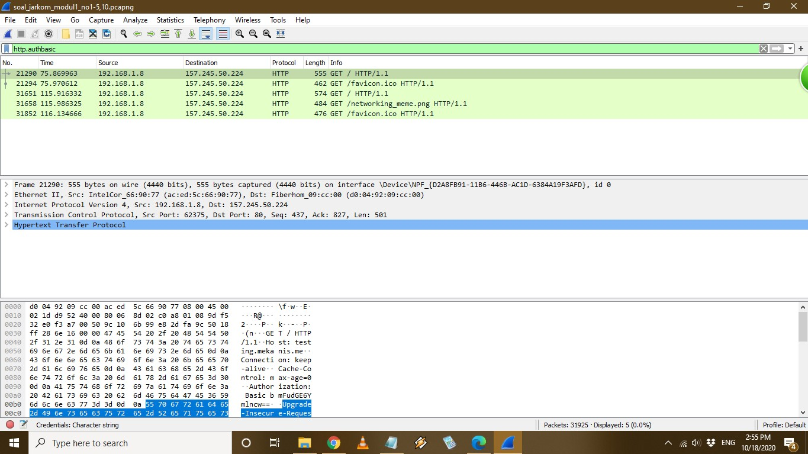
5. *http.host == “aku.pengen.pw”*


6. ...

7. ...

8. *ftp.request.command == RETR*


9. *ftp.request.command =="USER" untuk melihat Username*

   *ftp.request.command =="PASS" untuk melihat Password*

10. *Control+F*
.PNG)
    *Klik kanan kemudian follow tcp stream, lalu ubah show and save data as menjadi RAW.*
.PNG)
    *Klik tombol Save as dan simpan file pdf*
.PNG)
    *Buka file yang telah didownload*
.PNG)
#### B. Capture Filter
11.*Buat User dan Shared Folder pada Filezilla Server kemudian log in sebagai User melalui Filezilla Client*
.PNG)
*Masukkab "port 21" pada "Capture filter for selected interfaces" dari adapter loopback traffic capture*
.PNG)
*File yang melalui port 21 atau FTP sudah terfilter*
.PNG)
12. *Masukkab "src port 80" pada "Capture filter for selected interfaces" dari Wi-Fi, kemudian akses website HTTP misalnya monta.if.its.ac.id*
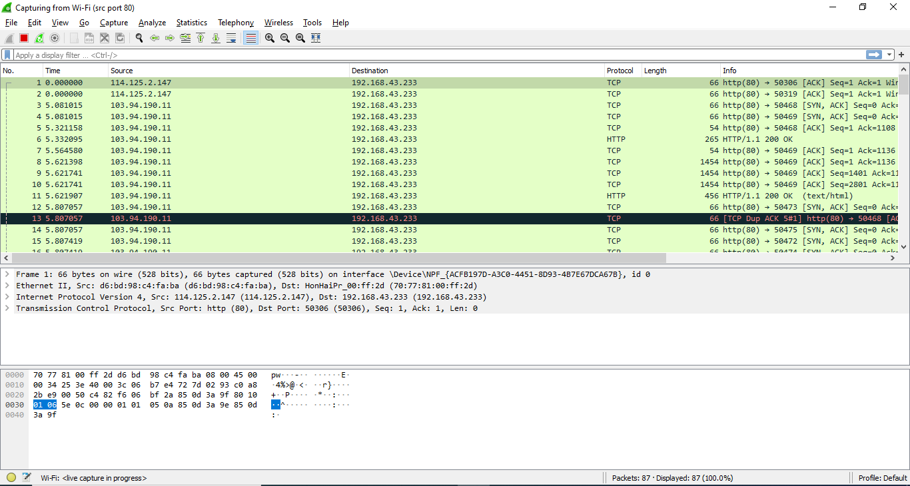
13. *Masukkab "dst port 443" pada "Capture filter for selected interfaces" dari Wi-Fi, kemudian akses website HTTPS misalnya its.ac.id*
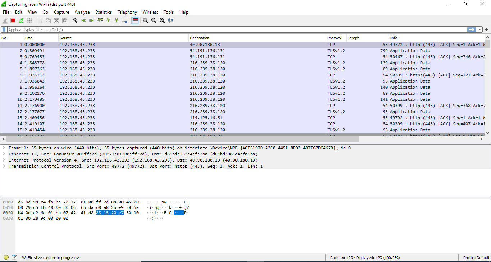
14. *Masukkab "src host 127.0.0.1" pada "Capture filter for selected interfaces" dari Adapter for loopback traffic capture*
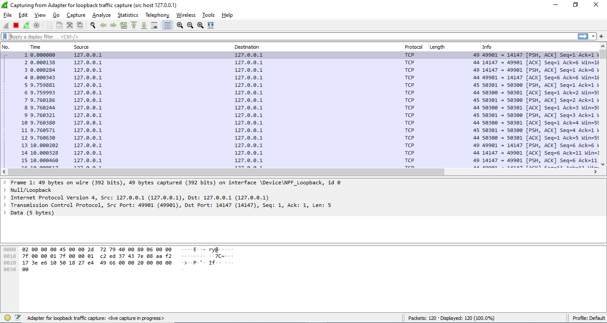
15. *Masukkab "src host monta.if.its.ac.id" pada "Capture filter for selected interfaces" dari Wi-Fi, kemudian akses website monta.if.its.ac.id*
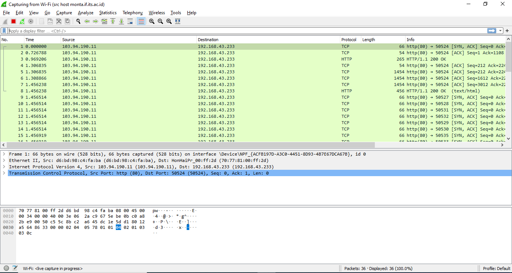
